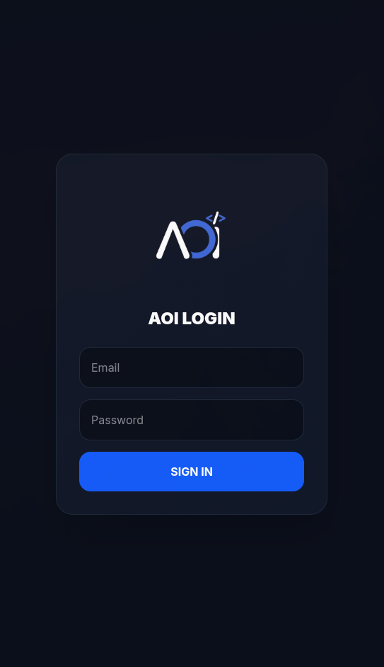
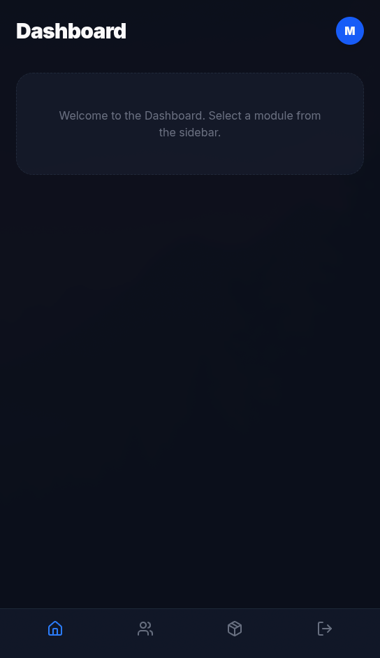
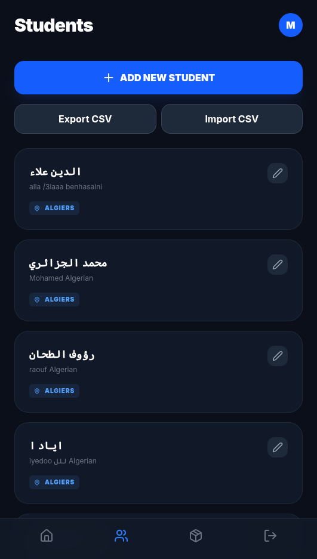
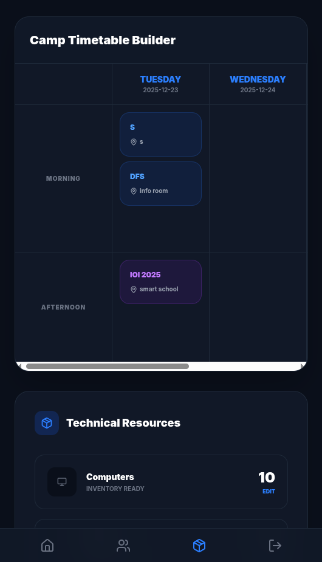
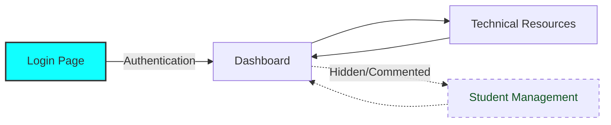

# New AOI admin management application
- login page 

- admin / users 

- data bases 

- Students 

- Edit information of students

- Elegent design (ig)

- Export all students to CSV or Excel format

- Import all students data and add it directly to database

- Edit existing students without changing form structure

- Form refreshes student list after operations (ig it's fast enought)

- phone - computer 

## pictures from app











## Getting Started

First, run the development server:

```bash
npm i
#to install packages
npm run dev
# or
yarn dev
# or
pnpm dev
# or
bun dev
```


Open [http://localhost:3000](http://localhost:3000) with your browser to see the result.


